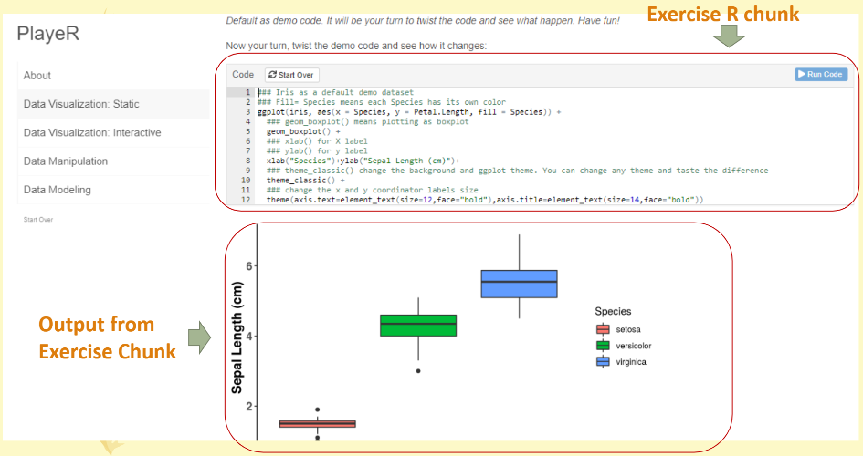

# Interactive_tutorial_website
This is an interactive tutorial website (PlayR) built by learnr package 

Here is a live demo (limited active hours): https://appforiarteam.shinyapps.io/PlayR/

`learnr` is an R package for developers/ educators to build an interactive website along with their course. Students/ users can exacute the code direactly in the website without installing anything. 

